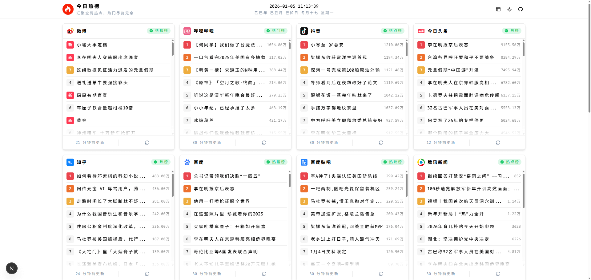
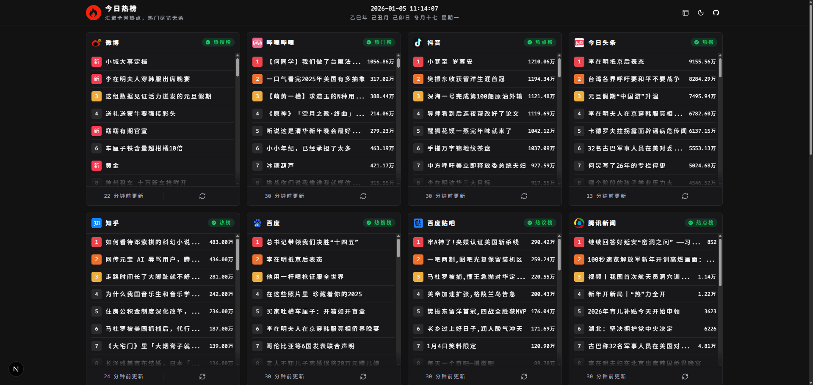

<div align="center">
  
  <h1>今日热榜</h1>
  <p><strong>汇聚全网热点，热门尽览无余</strong></p>
  
  <p>
    <a href="https://hot.baiwumm.com/" target="_blank">
      
    </a>
    <a href="https://github.com/baiwumm/next-daily-hot/stargazers" target="_blank">
      
    </a>
    <a href="./LICENSE" target="_blank">
    
  </a>
  </p>
  
  <p>
    
    
    
    
  </p>
</div>

---

## 📋 目录

- [🚀 项目简介](#-项目简介)
- [✨ 核心特性](#-核心特性)
- [🛠️ 技术栈](#️-技术栈)
- [💻 演示预览](#-演示预览)
- [💯 支持平台](#-支持平台)
- [🚀 快速开始](#-快速开始)
- [📦 部署指南](#-部署指南)
- [⚠️ 免责声明](#️-免责声明)
- [🙏 致谢](#-致谢)

## 🚀 项目简介

**今日热榜** 是一个基于 Next.js 构建的现代化热点聚合平台，实时汇聚各大主流网站的热门内容，为用户提供一站式的热点资讯浏览体验。

### 🎯 项目亮点

- 🔥 **实时热点** - 聚合 17+ 主流平台热门内容
- ⚡ **极速体验** - SSR 渲染，首屏加载快速
- 🎨 **现代设计** - 支持明暗主题切换
- 📱 **响应式** - 完美适配桌面端和移动端
- 🚀 **易部署** - 支持 Vercel 一键部署

## ✨ 核心特性

- 🆕 **最新技术栈** - 基于 React 19、Next.js16.x 等前沿技术
- ⚡ **极速响应** - 优化的数据获取和缓存策略
- 🏗️ **架构清晰** - 模块化设计，易于维护和扩展
- 🌙 **主题切换** - 内置明暗主题，护眼体验
- 🔍 **SEO 友好** - SSR 渲染，搜索引擎优化
- 📊 **数据可视** - 直观的热度展示和排行

## 🛠️ 技术栈

| 技术 | 版本 | 描述 |
|------|------|------|
| [React](https://react.dev/) | 19+ | 用户界面构建库 |
| [Next.js](https://nextjs.org/) | 16+ | 全栈 React 框架 |
| [TypeScript](https://www.typescriptlang.org/) | 5+ | 类型安全的 JavaScript |
| [Tailwind CSS](https://tailwindcss.com/) | 4+ | 原子化 CSS 框架 |
| [HeroUI](https://www.heroui.com/) | 2+ | 现代化 Next.js UI 库 |

## 💻 演示预览

<div align="center">
  <h3>🌞 亮色模式</h3>
  
  
  <h3>🌙 暗色模式</h3>
  
</div>

## 💯 支持平台

> **状态说明：** ✅ 稳定运行 | ⭕ 偶尔不稳定 | ❌ 暂不可用

### 📱 社交媒体
| 平台 | 类别 | 状态 | API |
|------|------|------|-----|
|  微博 | 热搜榜 | ✅ | [weibo](./src/app/api/weibo/route.ts) |
|  抖音 | 热点榜 | ✅ | [douyin](./src/app/api/douyin/route.ts) |
|  快手 | 热榜 | ✅ | [kuaishou](./src/app/api/kuaishou/route.ts) |

### 🎬 娱乐内容
| 平台 | 类别 | 状态 | API |
|------|------|------|-----|
|  哔哩哔哩 | 热门榜 | ✅ | [bilibili](./src/app/api/bilibili/route.ts) |
|  豆瓣电影 | 新片榜 | ✅ | [douban-movic](./src/app/api/douban-movic/route.ts) |
|  网易云音乐 | 热歌榜 | ⭕ | [netease-music](./src/app/api/netease-music/route.ts) |

### 📰 新闻资讯
| 平台 | 类别 | 状态 | API |
|------|------|------|-----|
|  今日头条 | 热榜 | ✅ | [toutiao](./src/app/api/toutiao/route.ts) |
|  腾讯新闻 | 热点榜 | ✅ | [qq](./src/app/api/qq/route.ts) |
|  网易新闻 | 热榜 | ✅ | [netease](./src/app/api/netease/route.ts) |
|  澎湃新闻 | 热榜 | ✅ | [thepaper](./src/app/api/thepaper/route.ts) |

### 🔍 搜索引擎
| 平台 | 类别 | 状态 | API |
|------|------|------|-----|
|  百度 | 热搜榜 | ✅ | [baidu](./src/app/api/baidu/route.ts) |
|  百度贴吧 | 热议榜 | ✅ | [baidutieba](./src/app/api/baidutieba/route.ts) |

### 💡 知识社区
| 平台 | 类别 | 状态 | API |
|------|------|------|-----|
|  知乎 | 热榜 | ✅ | [zhihu](./src/app/api/zhihu/route.ts) |
|  稀土掘金 | 热榜 | ✅ | [juejin](./src/app/api/juejin/route.ts) |

### 📚 其他服务
| 平台 | 类别 | 状态 | API |
|------|------|------|-----|
|  微信读书 | 飙升榜 | ✅ | [weread](./src/app/api/weread/route.ts) |
|  英雄联盟 | 更新公告 | ✅ | [lol](./src/app/api/lol/route.ts) |
|  历史上的今天 | 百科 | ✅ | [history-today](./src/app/api/history-today/route.ts) |

## 🚀 快速开始

### 📋 环境要求

- **Node.js** >= 20.9
- **pnpm** >= 8.0.0 (推荐最新) 或 npm/yarn

### 🛠️ 本地开发

```bash
# 1. 克隆项目
git clone https://github.com/baiwumm/next-daily-hot.git

# 2. 进入项目目录
cd next-daily-hot

# 3. 安装依赖
pnpm install

# 4. 启动开发服务器
pnpm dev

# 5. 打开浏览器访问
# http://localhost:3000
```

### 🏗️ 构建部署

```bash
# 构建生产版本
pnpm build

# 启动生产服务器
pnpm start

# 代码检查
pnpm lint

# 类型检查
pnpm type-check
```

## 📦 部署指南

### 🚀 Vercel 一键部署

[](https://vercel.com/new/clone?repository-url=https://github.com/baiwumm/next-daily-hot)

**手动部署步骤：**

1. Fork 本项目到你的 GitHub 账户
2. 在 [Vercel](https://vercel.com/dashboard) 中点击 "New Project"
3. 选择你 Fork 的项目仓库
4. 保持默认配置，点击 "Deploy"
5. 等待部署完成，获取访问链接

### 🔧 Vercel CLI 部署

```bash
# 安装 Vercel CLI
npm i -g vercel

# 登录 Vercel
vercel login

# 部署到预览环境
vercel

# 部署到生产环境
vercel --prod
```

## 🤝 贡献指南

我们欢迎所有形式的贡献！如果你想为项目做出贡献，请遵循以下步骤：

### 🐛 报告问题

- 使用 [GitHub Issues](https://github.com/baiwumm/next-daily-hot/issues) 报告 bug
- 提供详细的问题描述和复现步骤
- 包含相关的错误信息和环境信息

### 💡 功能建议

- 通过 Issues 提出新功能建议
- 描述功能的使用场景和预期效果
- 欢迎提供设计思路和实现方案

### 📝 添加新平台

如果你想添加新的热点平台支持：

1. 在 `src/app/api/` 目录下创建新的路由文件
2. 实现数据获取逻辑
3. 添加对应的图标到 `public/` 目录
4. 更新 README.md 中的平台列表
5. 提交 PR 并说明新平台的特点

## ⚠️ 免责声明

> ⚠️ **重要提醒：请仔细阅读以下声明**

### 📋 使用条款

1. **数据来源**：本项目通过公开 API 和网页抓取获取数据，仅供学习和研究使用
2. **合规使用**：用户需遵守各平台的使用条款和相关法律法规
3. **商业使用**：禁止将本项目用于任何商业用途
4. **数据准确性**：不保证数据的实时性和准确性

### 🛡️ 责任限制

- 本项目仅供技术研究和学习交流使用
- 任何因使用本项目产生的法律风险由使用者自行承担
- 如有平台方要求移除相关接口，请及时联系我们处理
- 项目维护者不承担任何直接或间接的损失责任

### 📞 联系方式

如有任何问题或建议，请通过以下方式联系：

- 📧 **邮箱**：[me@baiwumm.com](mailto:me@baiwumm.com)
- 🐛 **Issues**：[GitHub Issues](https://github.com/baiwumm/next-daily-hot/issues)
- 💬 **讨论**：[GitHub Discussions](https://github.com/baiwumm/next-daily-hot/discussions)

## 📄 许可证

本项目基于 [MIT 许可证]( LICENSE) 开源。

## 🙏 致谢

### 💖 开源项目

感谢以下开源项目为本项目提供的灵感和支持：

- [imsyy/DailyHot](https://github.com/imsyy/DailyHot) - 原始项目灵感来源
- [imsyy/DailyHotApi](https://github.com/imsyy/DailyHotApi) - API 设计参考
- [Next.js](https://nextjs.org/) - 强大的 React 框架
- [Tailwind CSS](https://tailwindcss.com/) - 优秀的 CSS 框架
- [HeroUI](https://www.heroui.com/) - 现代化的 Next.js UI 库

### 🌟 赞助商

<div align="center">
  <h4>🚀 CDN 加速服务由 Tencent EdgeOne 提供</h4>
  <a href="https://edgeone.ai/zh?from=github" target="_blank">
    
  </a>
  <p><em>亚洲最佳 CDN、边缘和安全解决方案</em></p>
</div>

### 🏆 贡献者

感谢所有为项目做出贡献的开发者们！

<a href="https://github.com/baiwumm/next-daily-hot/graphs/contributors">
  
</a>

---

## ⭐ Star History

<div align="center">
  
</div>

---

<div align="center">
  <p>如果这个项目对你有帮助，请给它一个 ⭐️</p>
  <p>Made with ❤️ by <a href="https://github.com/baiwumm">@baiwumm</a></p>
  <p>© 2025 今日热榜. All rights reserved.</p>
</div>
