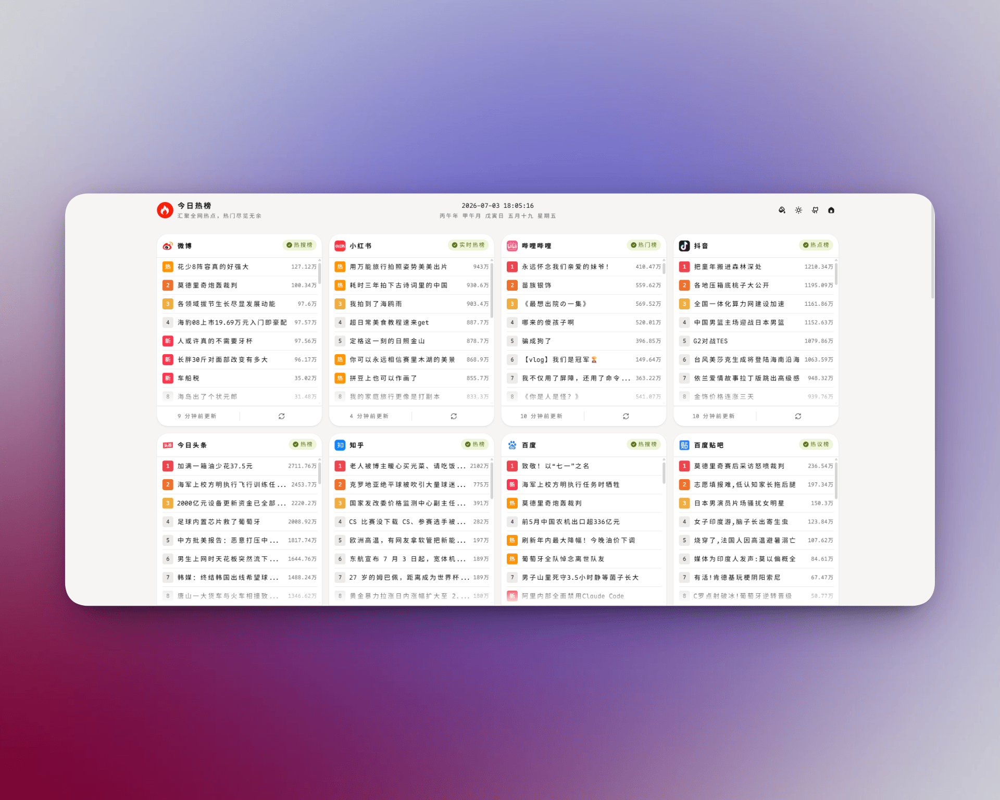

<div align="center">
  
  <h1>今日热榜</h1>
  <p align="center">汇聚全网热点资讯，实时掌握热门趋势</p>
  <p align="center">
    
    
    
    
    
  </p>
</div>

---

### 📸 预览

<div align="center">
  
</div>

### 🚀 特性

- 🔥 聚合 30+ 热门平台（微博、知乎、B站、抖音、GitHub 等）
- ⚡ 基于 Next.js SSR，快速加载
- 🎨 支持明暗主题切换
- 📱 响应式设计，适配移动端
- 🔍 SEO 优化，搜索友好
- 🏗️ 模块化架构，方便扩展

### 🛠️ 本地开发

```bash
# 1. 克隆项目
git clone https://github.com/baiwumm/next-daily-hot.git

# 2. 进入项目目录
cd next-daily-hot

# 3. 安装依赖
pnpm install

# 4. 启动开发服务器
pnpm dev

# 5. 打开浏览器访问
http://localhost:3000
```

### 🚀 Vercel 一键部署

[](https://vercel.com/new/clone?repository-url=https://github.com/baiwumm/next-daily-hot)

点击按钮即可快速部署到 Vercel。

部署完成后，请在 **Vercel Project Settings → Environment Variables** 中配置环境变量。

环境变量参考：[.env](./.env)

### ⭐ 支持项目
<div align="center">
  <p>如果这个项目对你有帮助，请给它一个 ⭐️</p>
  <p>Made with ❤️ by <a href="https://github.com/baiwumm">@baiwumm</a></p>
  <p>© 2025-至今 今日热榜. All rights reserved.</p>
</div>
