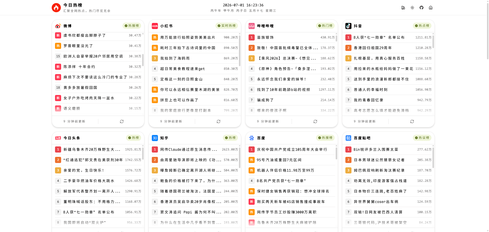
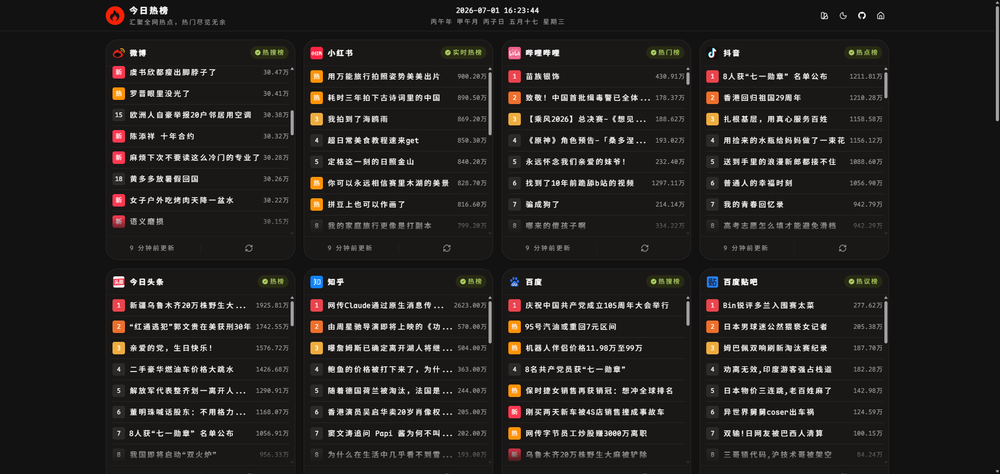

<div align="center">
  
  <h1>今日热榜</h1>
  <p align="center">看看全网都在聊什么</p>
  <p align="center">
    
    
    
    
    
  </p>
</div>

---

### 📸 预览

<div align="center">
  
  <br />
  
</div>

### 🚀 特性

- 🔥 聚合 44 个热门平台（微博、知乎、B站、抖音、原神 等），七大分类
- 🗂️ 分类分节布局 + 锚点导航，分类 / 平台两级排序与显隐
- 📈 排名趋势标记（↑ / ↓ / 新）
- ⌨️ Ctrl / ⌘ + K 全局搜索，跨卡片条目定位
- ⚡ 基于 Next.js SSR，快速加载
- 🎨 支持明暗主题切换
- 📱 响应式设计，适配移动端
- 🔍 SEO 优化，搜索友好
- 🧩 模块化架构，新增一个榜单只需两步

### 🛠️ 本地开发

```bash
# 1. 克隆项目
git clone https://github.com/baiwumm/daily-trending.git

# 2. 进入项目目录
cd daily-trending

# 3. 安装依赖
pnpm install

# 4. 启动开发服务器
pnpm dev

# 5. 打开浏览器访问
http://localhost:3000
```

### 🔌 开放 API

所有榜单数据通过统一端点暴露：`GET /api/<value>`（`value` 为平台标识），返回结构：

```json
{
  "code": 200,
  "msg": "请求成功",
  "data": [
    {
      "id": "唯一标识",
      "title": "标题",
      "url": "详情地址",
      "mobileUrl": "移动端地址",
      "hot": 12345,
      "desc": "描述（可选）",
      "pic": "封面图（可选）"
    }
  ],
  "timestamp": 1791500000000
}
```

`code` 为 200 成功（CDN 缓存 300 秒，URL 加 `?t=` 时间戳可绕过）、500 失败（不缓存）；`timestamp` 为数据更新时间。

端点 `value` 与上游平台的对应关系以 `src/enums/index.tsx` 的 `hotItemsConfig` 为准（唯一数据源，当前 7 个分类 44 个榜单）；`value` 即 `src/app/api/<value>/route.ts` 的目录名。

> ⚠️ 线上站点已启用 Vercel Security Checkpoint：脚本 / 服务端直连 `https://hot.baiwumm.com/api/*` 会返回 429 挑战页（与 UA 无关）。接口调试请使用本地构建服务（`pnpm build && pnpm start` 后访问 `http://127.0.0.1:3000`）。

### 🚀 Vercel 一键部署

[](https://vercel.com/new/clone?repository-url=https://github.com/baiwumm/daily-trending)

点击按钮即可快速部署到 Vercel。

部署完成后，请在 **Vercel Project Settings → Environment Variables** 中配置环境变量。

环境变量参考：[.env](./.env)

### ⭐ 支持项目
<div align="center">
  <p>如果这个项目对你有帮助，请给它一个 ⭐️</p>
  <p>Made with ❤️ by <a href="https://github.com/baiwumm">@baiwumm</a></p>
  <p>© 2025-至今 今日热榜. All rights reserved.</p>
</div>
